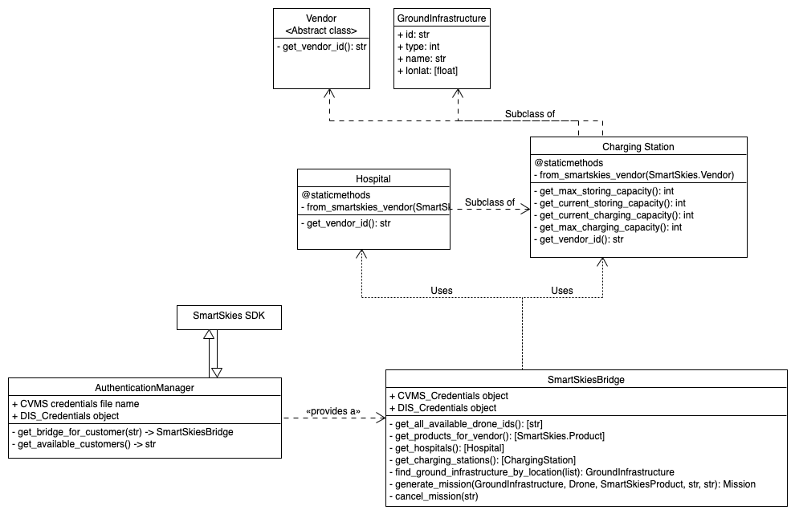

# CAELUS_GroundInfrastructure

[](https://github.com/strathclyde-artificial-intelligence/CAELUS_GroundInfrastructure/actions/workflows/python-app.yml)

This package is meant to be used as a ground infrastructure manager for the CAELUS project.
It supports drone state tracking (syncs with local db), mission payload generation (to be used in tandem with the CAELUS Orchestrator),
simplified SmartSkies communication through the SmartSkies bridge and Authenticator.

# Dependencies
To install the required dependencies issue `pip3 install -r requirements.txt`.

# Credentials setup (SmartSkies Bridge)
To avoid pushing sensitive data to the GitHub repo, this project makes use of .env files for tests.
Create a `.env.test` file in the root directory of the project.
The file must contain the authentication information for the test accounts (CVMS and DIS).

Here's what to put in the `.env.test` file:

```
DIS_GRANT_TYPE=<grant_type>
DIS_CLIENT_ID=<client_id>
DIS_USERNAME=<your_username>
DIS_PASSWORD=<your_password>
```

# Running tests
From the project's root folder, issue `python3 -m pytest`.

# Authentication Manager
The authentication manager is a Python package that provides a simple interface to the SmartSkies Bridge.
To initialise it, provide a credentials file with schema:

```json
    [
        {
            "name": "Glasgow Royal Infirmary",
            "grant_type": "password",
            "client_id": "",
            "username": "",
            "password": ""
        },
        {
            "name": "Aberdeen Airport",
            "grant_type": "password",
            "client_id": "",
            "username": "",
            "password": ""
        }
    ]
```
and a DIS_Credentials ([PySmartSkies](https://github.com/H3xept/CAELUS_SmartSkies)) object.

Name can be any string that represents the customer.
Other parameters can be obtained from ANRA.

Here's a UML diagram for the authentication manager:


# Drone State Manager
This object is responsible for managing the state of the drone.
Make sure to interact with this object and not with Drones directly.
Here's a UML diagram for the drone state manager:


# Bridges
A bridge is an interface useful to communicate with the SmartSkies API.
It uses the DIS_API and CVMS_API objects to perform the communication.
Every bridge is authenticated with one of the accounts in the credentials file (CVMS) and the shared dispatcher (DIS).

## Requesting for a bridge
The authentication manager can be used to request a bridge.
Essentially, each bridge can be thought as an object to interact with the SmartSkies API through a specific account.
To do so, provide the name of the bridge to the `authentication_manager.get_bridge_for_customer` function.
