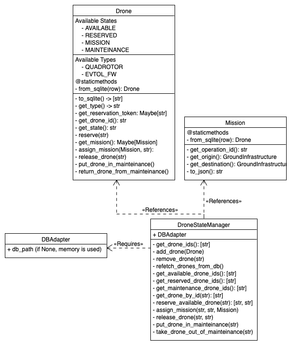

# CAELUS_GroundInfrastructure

[](https://github.com/strathclyde-artificial-intelligence/CAELUS_GroundInfrastructure/actions/workflows/python-app.yml)

# Dependencies
To install the required dependencies issue `pip3 install -r requirements.txt`.

# Credentials setup (SmartSkies Bridge)
To avoid pushing sensitive data to the GitHub repo, this project makes use of .env files for tests.
Create a `.env.test` file in the root directory of the project.
The file must contain the authentication information for the test accounts (CVMS and DIS).

Here's an example `.env.test` file:

```
DIS_GRANT_TYPE=<grant_type>
DIS_CLIENT_ID=<client_id>
DIS_USERNAME=<your_username>
DIS_PASSWORD=<your_password>
```

# Running tests
From the project's root folder, issue `python3 -m pytest`.

# Authentication Manager
The authentication manager is a Python package that provides a simple interface to the SmartSkies Bridge.
To initialise it, provide a credentials file with schema:
```json
    [
        {
            "name": "CVMS",
            "grant_type": "password",
            "client_id": "",
            "username": "",
            "password": ""
        },
        {
            "name": "DIS",
            "grant_type": "password",
            "client_id": "",
            "username": "",
            "password": ""
        }
    ]
```
and a DIS_Credentials object.

Here's a UML diagram for the authentication manager:


# Drone State Manager
This object is responsible for managing the state of the drone.
Make sure to interact with this object and not with Drones directly.
Here's a UML diagram for the drone state manager:


## Reuqesting for a bridge
The authentication manager can be used to request a bridge.
To do so, provide the name of the bridge to the `authentication_manager.get_bridge_for_customer` function.
